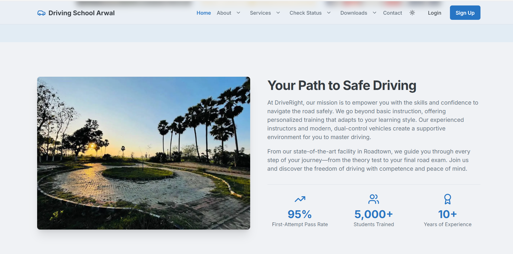
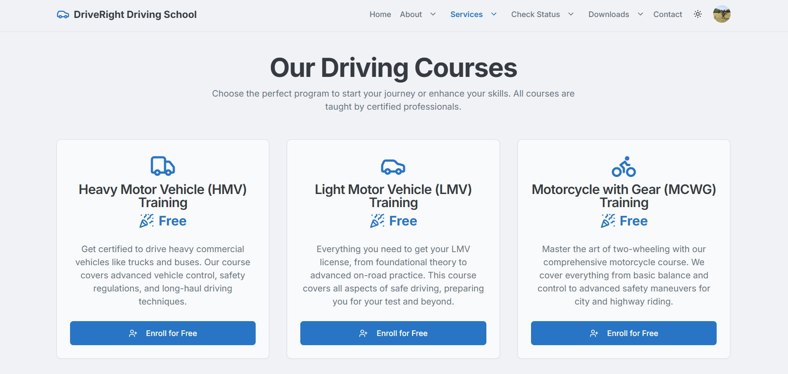
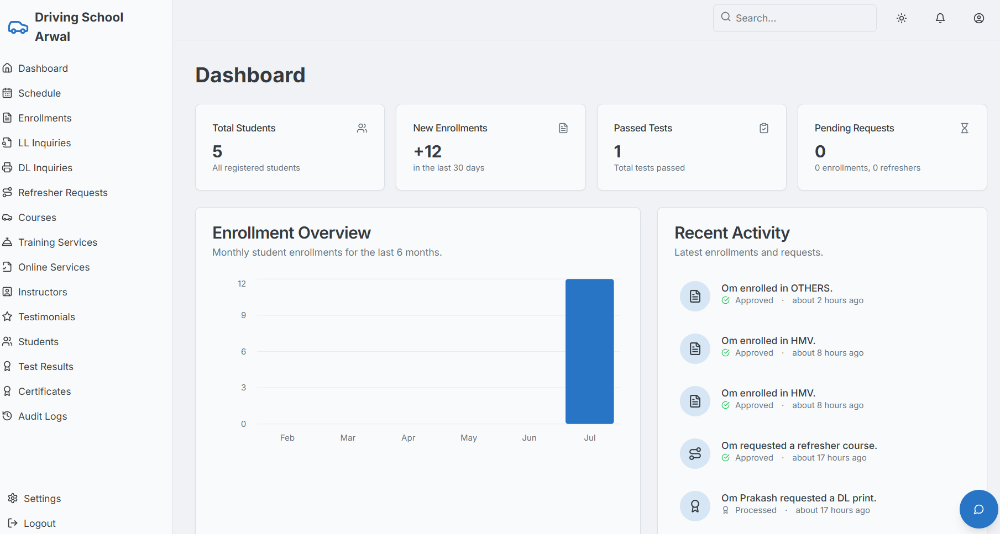
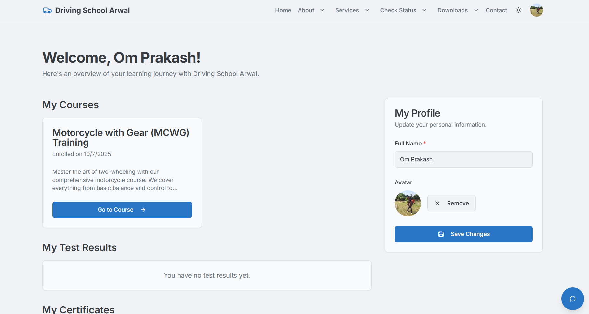
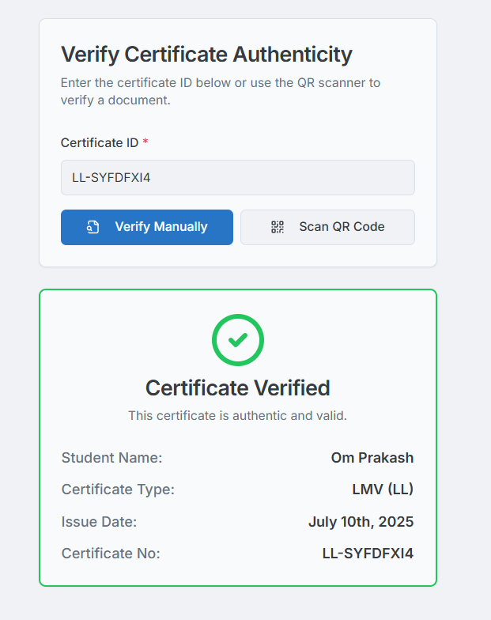
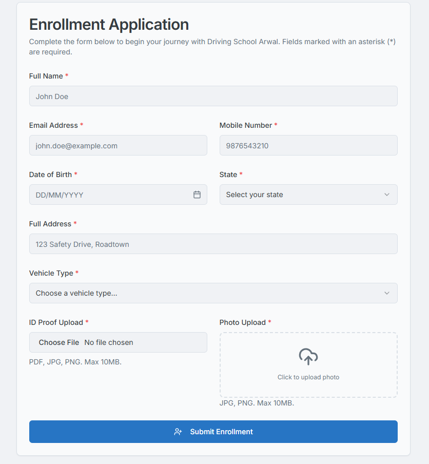

<div align="center">
  <a href="https://github.com/omprakash24d/Driving-School-Arwal">
    
  </a>

  <h1 align="center">🚗 Driving School Arwal - AI-Powered Driving School Portal</h1>
  
  <p align="center">
    A modern, enterprise-grade, AI-enhanced web application for driving schools, built with Next.js, Firebase, and Google's Genkit.
    <br />
    <strong>Now featuring centralized configuration management and automated backup systems!</strong>
    <br />
    <a href="#-key-features"><strong>Explore Features »</strong></a>
    <br />
    <br />
    <a href="https://www.drivingschoolarwal.in">View Live Site</a>
    ·
    <a href="https://staging.drivingschoolarwal.in">Staging Demo</a>
    ·
    <a href="https://github.com/omprakash24d/Driving-School-Arwal/issues">Report Bug</a>
    ·
    <a href="https://github.com/omprakash24d/Driving-School-Arwal/issues">Request Feature</a>
  </p>

  <p align="center">
    
    
    
    
    
    
    
  </p>
</div>

---

## 🧭 Table of Contents

- [� Quick Start](#-quick-start)
- [�🔑 Why Driving School Arwal?](#-why-driving-school-arwal)
- [✨ Key Features](#-key-features)
- [🎯 New: Configuration Management System](#-new-configuration-management-system)
- [💾 Enterprise Backup System](#-enterprise-backup-system)
- [📸 Screenshot Gallery](#-screenshot-gallery)
- [🚀 Tech Stack](#-tech-stack)
- [🛠️ Installation & Setup](#️-installation--setup)
- [⚙️ Configuration Guide](#️-configuration-guide)
- [👑 Admin Panel](#-admin-panel)
- [📁 Project Structure](#-project-structure)
- [🚀 Deployment Guide](#-deployment-guide)
- [🔧 Production Scripts](#-production-scripts)
- [📊 Monitoring & Analytics](#-monitoring--analytics)
- [🛡️ Security Features](#️-security-features)
- [🤝 Contributing](#-contributing)
- [📜 License](#-license)
- [📧 Contact](#-contact)

---

## 🚀 Quick Start

### 🔐 Security-First Setup

**This repository is configured for secure deployment with no exposed credentials.**

```bash
# 1. Clone the repository
git clone https://github.com/omprakash24d/DriveRight.git
cd DriveRight

# 2. Install dependencies
npm install

# 3. Setup configuration (copy templates)
cp config/project-config.example.cjs config/project-config.cjs
cp .env.example .env

# 4. Configure your project with actual values
# Edit config/project-config.cjs with your business details
# Edit .env with your API keys and credentials

# 5. Start development server
npm run dev
```

### ⚡ Alternative: Interactive Setup

```bash
# Use the automated configuration updater
npm run config:update
```

Visit `http://localhost:9002` to see your driving school portal in action! 🎉

### 🛡️ Security Notice

- ✅ **No sensitive data** is stored in this repository
- ✅ **All secrets** are managed through environment variables
- ✅ **Templates provided** for easy and secure setup
- ✅ **Enterprise-grade security** measures implemented

**CRITICAL:** Never commit your actual `.env` or `config/project-config.cjs` files!

---

## 🔑 Why Driving School Arwal?

**Driving School Arwal** is more than just a website; it's a complete **enterprise-grade digital ecosystem** designed to modernize driving school operations. Built with cutting-edge technology and AI-powered features, it bridges the gap between students, instructors, and administrators with a seamless, intuitive platform.

### 🌟 What Makes It Special?

- **🎯 Centralized Configuration**: Update all project settings from a single file
- **🔄 Automated Backup System**: Enterprise-grade data protection with daily/weekly/monthly backups
- **🤖 AI-Powered Intelligence**: Smart chatbots, personalized feedback, and automated insights
- **📱 Mobile-First Design**: Responsive design optimized for all devices
- **🔒 Enterprise Security**: Advanced authentication, audit logs, and GDPR compliance
- **⚡ High Performance**: Optimized for speed with CDN integration and caching strategies

Whether it's online enrollment, personalized learning feedback, comprehensive admin management, or disaster recovery, **Driving School Arwal** handles it all, allowing schools to focus on creating safe, confident drivers.

---

## ✨ Key Features

This application provides a comprehensive digital experience for students, instructors, and administrators.

### For Students & Public Users

- **📝 Smart Online Enrollment**: Comprehensive form with document uploads, photo cropping, and real-time validation
- **📚 Interactive Course Catalog**: Browse available courses (LMV, HMV, MCWG) with detailed information
- **🔒 Secure Authentication**: Multi-factor authentication with email verification
- **� Personal Dashboard**: View enrolled courses, progress tracking, test results, and certificates
- **📜 Digital Certificate System**:
  - Download official completion certificates with QR codes
  - Verify authenticity via unique ID or QR code scanning
  - Blockchain-ready certificate validation
- **🤖 AI-Powered 24/7 Assistant**: Intelligent chatbot with real-time data access
- **📈 Personalized AI Feedback**: Test result analysis with improvement suggestions
- **📱 Mobile App Features**: Progressive Web App (PWA) capabilities
- **🔔 Smart Notifications**: Email and push notifications for important updates

### For School Administrators

- **🎛️ Advanced Admin Dashboard**: Real-time analytics, KPIs, and performance metrics
- **⚙️ Complete Management System**:
  - **Course Management**: Full CRUD with lesson planning and module organization
  - **Instructor Profiles**: Detailed instructor management with performance tracking
  - **Student Records**: Comprehensive student lifecycle management
  - **Certificate Authority**: Digital certificate generation and verification
- **📊 Analytics & Reporting**:
  - Student performance analytics
  - Revenue tracking and financial reports
  - Instructor performance metrics
  - Custom report generation
- **� AI-Powered Administrative Tools**:
  - Automated lesson plan generation
  - Predictive analytics for student success
  - Smart scheduling optimization
- **🔐 Enterprise Security**:
  - Role-based access control (RBAC)
  - Comprehensive audit logging
  - GDPR compliance tools
  - Data encryption and backup

---

## 🎯 New: Configuration Management System

**Revolutionary centralized configuration** - Update your entire project from a single file!

### 🚀 Key Benefits

- **One File, All Updates**: Modify `config/project-config.cjs` to update 25+ files automatically
- **Environment Management**: Automatic generation of development, staging, and production configs
- **Zero Downtime Updates**: Update business information without touching code
- **Error Prevention**: Automated validation and consistency checks

### 📝 Quick Configuration Update

```bash
# Update all project configurations
npm run config:update

# Generate fresh environment files
npm run config:generate
```

### 🔧 Configuration Structure

```javascript
// config/project-config.cjs
module.exports = {
  business: {
    name: "Driving School Arwal",
    domain: "www.drivingschoolarwal.in",
    contact: {
      email: "nitishkr3404@gmail.com",
      phone: "+919430420215",
      address:
        "Jinpura Near Police line..and collectorate, Arwal Sipah Panchayat, Bihar 804401",
    },
  },
  firebase: {
    projectId: "your-firebase-project-id",
    // ... all Firebase configuration
  },
  // ... complete configuration
};
```

### 🌍 Multi-Environment Support

| Environment     | URL                                     | Purpose           |
| --------------- | --------------------------------------- | ----------------- |
| **Development** | `http://localhost:9002`                 | Local development |
| **Staging**     | `https://staging.drivingschoolarwal.in` | Testing & QA      |
| **Production**  | `https://www.drivingschoolarwal.in`     | Live website      |

---

## 💾 Enterprise Backup System

**Comprehensive automated backup solution** protecting your valuable data.

### 🛡️ Backup Features

- **📅 Scheduled Backups**: Daily, weekly, and monthly automated backups
- **🔄 Full System Backup**: Database, storage, and application code
- **☁️ Cloud Storage**: Secure cloud-based backup storage
- **� Encrypted Backups**: Military-grade encryption for data protection
- **⚡ Point-in-Time Recovery**: Restore to any previous backup point
- **📊 Backup Monitoring**: Real-time backup status and health checks

### 🚀 Backup Commands

```bash
# Full system backup
npm run backup:full

# Daily automated backup
npm run backup:daily

# Weekly backup with extended retention
npm run backup:weekly

# Monthly backup for long-term storage
npm run backup:monthly

# Restore from backup
npm run backup:restore

# List available backups
node scripts/backup-system.cjs list

# Cleanup old backups
node scripts/backup-system.cjs cleanup
```

### 📋 Backup Components

| Component              | Description                          | Frequency |
| ---------------------- | ------------------------------------ | --------- |
| **Firestore Database** | All user data, courses, certificates | Daily     |
| **Firebase Storage**   | Images, documents, certificates      | Daily     |
| **Application Code**   | Source code with git commit info     | Weekly    |
| **Configuration**      | Environment and settings backup      | Daily     |

### 🔄 Disaster Recovery

```bash
# Emergency restore procedure
node scripts/backup-system.cjs restore firestore-daily-2024-07-22_10-30-00
node scripts/backup-system.cjs restore storage-daily-2024-07-22_10-30-00
node scripts/backup-system.cjs restore application-weekly-2024-07-22_10-30-00
```

---

## 📸 Screenshot Gallery

<details>
<summary>Click to view screenshots</summary>

|                                                      Homepage                                                       |                                              Courses Page                                               |
| :-----------------------------------------------------------------------------------------------------------------: | :-----------------------------------------------------------------------------------------------------: |
|  |  |

|                                                   Admin Dashboard                                                   |                                                    Student Dashboard                                                    |
| :-----------------------------------------------------------------------------------------------------------------: | :---------------------------------------------------------------------------------------------------------------------: |
|  |  |

|                                                           Certificate Verification                                                            |                                          Enrollment Form                                           |
| :-------------------------------------------------------------------------------------------------------------------------------------------: | :------------------------------------------------------------------------------------------------: |
|  |  |

</details>

---

## 🚀 Tech Stack

This project leverages a modern, enterprise-grade technology stack optimized for performance, scalability, and maintainability.

### 🏗️ Core Technologies

| Category          | Technology                                                                                            | Version | Purpose                    |
| ----------------- | ----------------------------------------------------------------------------------------------------- | ------- | -------------------------- |
| **Framework**     |             | 14.2.3  | Full-stack React framework |
| **Frontend**      |                        | 18+     | UI library with hooks      |
| **Language**      |          | 5+      | Type-safe development      |
| **Styling**       |  | 3+      | Utility-first CSS          |
| **UI Components** |              | Latest  | Modern component library   |

### 🔥 Backend & Database

| Category           | Technology                                                                                              | Purpose                        |
| ------------------ | ------------------------------------------------------------------------------------------------------- | ------------------------------ |
| **Database**       |                | NoSQL document database        |
| **Authentication** |        | User authentication & security |
| **Storage**        |  | File storage & CDN             |
| **Functions**      |    | Serverless backend logic       |

### 🤖 AI & Analytics

| Category           | Technology                                                                                                      | Purpose                      |
| ------------------ | --------------------------------------------------------------------------------------------------------------- | ---------------------------- |
| **AI Framework**   |                   | AI-powered features          |
| **Language Model** |                          | Natural language processing  |
| **Analytics**      |  | User behavior tracking       |
| **Monitoring**     |                                | Error tracking & performance |

### ☁️ Deployment & DevOps

| Category        | Technology                                                                                                   | Purpose                     |
| --------------- | ------------------------------------------------------------------------------------------------------------ | --------------------------- |
| **Hosting**     |                              | Primary deployment platform |
| **Alternative** |       | Alternative hosting option  |
| **CDN**         |                 | Global content delivery     |
| **Backup**      |  | Automated backup system     |

### 🛠️ Development Tools

| Category            | Technology                                                                              | Purpose               |
| ------------------- | --------------------------------------------------------------------------------------- | --------------------- |
| **Package Manager** |                 | Dependency management |
| **Code Quality**    |        | Code linting          |
| **Formatting**      |  | Code formatting       |
| **Git Hooks**       |              | Pre-commit hooks      |

---

## 🛠️ Installation & Setup

### 📋 Prerequisites

Ensure you have the following installed on your system:

- [Node.js](https://nodejs.org/) (v18.17 or later)
- [npm](https://www.npmjs.com/) (comes with Node.js)
- [Git](https://git-scm.com/) for version control
- [Firebase CLI](https://firebase.google.com/docs/cli) (optional, for advanced features)

### 🚀 Installation Steps

#### 1. Clone the Repository

```bash
git clone https://github.com/omprakash24d/Driving-School-Arwal.git
cd Driving-School-Arwal
```

#### 2. Install Dependencies

```bash
npm install
```

#### 3. Initial Configuration

The project includes a **centralized configuration system**. Start by setting up your basic configuration:

```bash
# This will guide you through the initial setup
npm run config:update
```

#### 4. Environment Setup

Copy the example environment file:

```bash
cp .env.example .env
```

The configuration system will automatically populate most values. You'll need to add:

- Firebase service account key
- API keys (Gmail, Google Maps, etc.)
- Any custom environment variables

#### 5. Firebase Setup

Create a Firebase project at [Firebase Console](https://console.firebase.google.com/):

1. Create a new project
2. Enable Firestore Database
3. Enable Authentication (Email/Password)
4. Enable Storage
5. Generate service account key
6. Update the configuration file with your Firebase details

#### 6. Start Development Server

```bash
npm run dev
```

Your application will be available at `http://localhost:9002` 🎉

### 🔧 Advanced Setup

#### Google AI (Gemini) Setup

1. Go to [Google AI Studio](https://aistudio.google.com/)
2. Create an API key
3. Add it to your environment configuration

#### Email Configuration (Gmail)

1. Enable 2-Factor Authentication on your Gmail account
2. Generate an App Password
3. Update SMTP configuration in your environment

---

## ⚙️ Configuration Guide

### 🎯 Centralized Configuration System

All project settings are managed through `config/project-config.cjs`. This file is the **single source of truth** for your entire application.

#### 📝 Configuration Structure

```javascript
// config/project-config.cjs
module.exports = {
  // Business Information
  business: {
    name: "Driving School Arwal",
    domain: "www.drivingschoolarwal.in",
    contact: {
      email: "nitishkr3404@gmail.com",
      phone: "+919430420215",
      whatsapp: "919430420215",
      address:
        "Jinpura Near Police line..and collectorate, Arwal Sipah Panchayat, Bihar 804401",
    },
    social: {
      facebook: "https://github.com/omprakash24d",
      twitter: "https://www.linkedin.com/in/omrakash24d/",
      instagram: "https://www.instagram.com/omprakash24d/",
      github: "https://github.com/omprakash24d",
    },
  },

  // Domain Configuration
  domains: {
    development: "http://localhost:9002",
    staging: "https://staging.drivingschoolarwal.in",
    production: "https://www.drivingschoolarwal.in",
  },

  // Firebase Configuration
  firebase: {
    projectId: "your-firebase-project-id",
    apiKey: "your-firebase-api-key",
    authDomain: "your-project.firebaseapp.com",
    storageBucket: "your-project.appspot.com",
    messagingSenderId: "123456789",
    appId: "1:123456789:web:abcdef123456789",
  },

  // Email Configuration
  email: {
    smtp: {
      host: "smtp.gmail.com",
      port: 465,
      user: "dr.omprakashmbbs@gmail.com",
    },
    from: "dr.omprakashmbbs@gmail.com",
    to: "omprakash24d@gmail.com",
  },

  // Payment Gateway
  payment: {
    razorpay: {
      keyId: "rzp_test_your_key_id",
    },
  },

  // External Services
  services: {
    geminiApiKey: "your_gemini_api_key",
    googleAnalyticsId: "G-XXXXXXXXXX",
    sentry: {
      dsn: "https://your-sentry-dsn@sentry.io/project-id",
      org: "your-sentry-org",
      project: "your-sentry-project",
    },
  },

  // Infrastructure
  infrastructure: {
    backupBucket: "drivingschoolarwal-backups",
    cdnUrl: "https://cdn.drivingschoolarwal.in",
    redisUrl: "redis://your-redis-instance:6379",
  },
};
```

#### 🔄 Updating Configuration

To update your entire project configuration:

1. **Edit** `config/project-config.cjs`
2. **Run** `npm run config:update`
3. **Commit** changes to git

This will automatically update 25+ files throughout your project!

#### 🌍 Environment-Specific Settings

The system automatically generates environment-specific configurations:

```bash
├── .env                    # Development environment
├── .env.staging           # Staging environment
├── .env.production        # Production environment
└── config/
    └── project-config.cjs # Master configuration
```

---

## 👑 Admin Panel

The admin panel is the **central command center** for managing your driving school operations.

### 🔐 Access & Authentication

- **URL**: `/admin` (e.g., `https://www.drivingschoolarwal.in/admin`)
- **Authentication**: Role-based access control (RBAC)
- **Security**: Multi-factor authentication with audit logging

#### First-Time Setup

1. Configure admin emails in `config/project-config.cjs`
2. Run `npm run config:update` to apply changes
3. Access the admin panel with your configured email
4. Complete the initial setup wizard

### 🎛️ Admin Dashboard Features

#### 📊 Analytics Dashboard

- Real-time enrollment statistics
- Student performance metrics
- Revenue tracking and financial reports
- Instructor performance analytics
- Custom KPI monitoring

#### ⚙️ Management Modules

| Module                       | Features                                              |
| ---------------------------- | ----------------------------------------------------- |
| **👥 Student Management**    | View profiles, track progress, manage enrollments     |
| **🎓 Course Management**     | Create courses, organize modules, manage content      |
| **👨‍🏫 Instructor Management** | Profile management, scheduling, performance tracking  |
| **📜 Certificate Authority** | Generate, manage, and verify digital certificates     |
| **📧 Communication Hub**     | Email campaigns, notifications, announcements         |
| **💰 Financial Management**  | Payment tracking, invoice generation, revenue reports |

#### 🤖 AI-Powered Tools

- **Smart Scheduling**: AI-optimized class scheduling
- **Predictive Analytics**: Student success prediction
- **Automated Reporting**: AI-generated insights and reports
- **Content Generation**: Auto-generated lesson plans and materials

### 🛡️ Security Features

- **Audit Logging**: Complete action tracking
- **Role-Based Permissions**: Granular access control
- **Data Encryption**: End-to-end data protection
- **Backup Integration**: Automated data backup
- **GDPR Compliance**: Privacy and data protection tools

### 🚀 Quick Admin Actions

```bash
# Seed database with default content
# (Run after first admin login)
Navigate to Admin > Settings > Seed Database

# Generate system reports
Navigate to Admin > Analytics > Reports

# Backup data manually
npm run backup:full

# View audit logs
Navigate to Admin > Security > Audit Logs
```

---

## 📁 Project Structure

A comprehensive overview of the project architecture:

```
Driving-School-Arwal/
├── 📁 config/                          # Centralized configuration
│   ├── project-config.cjs              # Master configuration file
│   └── environments/                   # Environment-specific configs
├── 📁 src/
│   ├── 📁 app/                         # Next.js App Router
│   │   ├── 📁 (home)/                  # Homepage components
│   │   ├── 📁 admin/                   # Admin panel routes
│   │   │   ├── dashboard/              # Admin dashboard
│   │   │   ├── students/               # Student management
│   │   │   ├── courses/                # Course management
│   │   │   ├── instructors/            # Instructor management
│   │   │   ├── certificates/           # Certificate management
│   │   │   ├── analytics/              # Analytics & reports
│   │   │   └── settings/               # System settings
│   │   ├── 📁 api/                     # API route handlers
│   │   │   ├── auth/                   # Authentication endpoints
│   │   │   ├── students/               # Student API endpoints
│   │   │   ├── courses/                # Course API endpoints
│   │   │   ├── certificates/           # Certificate API endpoints
│   │   │   └── ai/                     # AI-powered endpoints
│   │   ├── 📁 about/                   # About page
│   │   ├── 📁 courses/                 # Course catalog
│   │   ├── 📁 contact/                 # Contact page
│   │   ├── 📁 dashboard/               # Student dashboard
│   │   ├── 📁 login/                   # Authentication pages
│   │   ├── 📁 signup/                  # Registration pages
│   │   └── 📁 certificate/             # Certificate verification
│   ├── 📁 components/                  # Reusable UI components
│   │   ├── 📁 ui/                      # ShadCN UI components
│   │   ├── 📁 form/                    # Form components
│   │   ├── AdminHeader.tsx             # Admin navigation
│   │   ├── Header.tsx                  # Public navigation
│   │   ├── Footer.tsx                  # Site footer
│   │   ├── Chatbot.tsx                 # AI chatbot component
│   │   └── ComplianceDashboard.tsx     # GDPR compliance tools
│   ├── 📁 lib/                         # Utility libraries
│   │   ├── firebase.ts                 # Firebase client config
│   │   ├── firebase-admin.ts           # Firebase admin config
│   │   ├── config.ts                   # App configuration
│   │   ├── utils.ts                    # Utility functions
│   │   ├── encryption.ts               # Data encryption utilities
│   │   └── audit-logger.ts             # Audit logging system
│   ├── 📁 services/                    # Data service layer
│   │   ├── studentsService.ts          # Student data operations
│   │   ├── coursesService.ts           # Course data operations
│   │   ├── instructorsService.ts       # Instructor data operations
│   │   ├── certificatesService.ts      # Certificate operations
│   │   ├── enrollmentsService.ts       # Enrollment management
│   │   ├── auditLogService.ts          # Audit log service
│   │   └── settingsService.ts          # System settings service
│   ├── 📁 ai/                          # AI & Genkit configuration
│   │   ├── genkit.ts                   # Genkit setup
│   │   ├── dev.ts                      # Development AI server
│   │   └── 📁 flows/                   # AI flow definitions
│   ├── 📁 context/                     # React context providers
│   │   └── AuthContext.tsx             # Authentication context
│   ├── 📁 hooks/                       # Custom React hooks
│   │   ├── use-toast.ts                # Toast notifications
│   │   ├── use-mobile.tsx              # Mobile device detection
│   │   └── use-realtime-data.ts        # Real-time data hooks
│   └── 📁 emails/                      # Email templates
│       └── 📁 templates/               # HTML email templates
├── 📁 scripts/                         # Automation scripts
│   ├── update-project-config.cjs       # Configuration update automation
│   ├── backup-system.cjs               # Enterprise backup system
│   ├── production-setup.cjs            # Production deployment setup
│   ├── performance-optimizer.cjs       # Performance optimization
│   └── migration-scripts/              # Database migration scripts
├── 📁 public/                          # Static assets
│   ├── 📁 images/                      # Image assets
│   ├── 📁 favicon/                     # Favicon files
│   └── robots.txt                      # SEO robots file
├── 📁 docs/                            # Documentation
│   ├── blueprint.md                    # Project blueprint
│   ├── api-documentation.md            # API documentation
│   └── deployment-guide.md             # Deployment instructions
├── 📄 .env                             # Development environment
├── 📄 .env.staging                     # Staging environment
├── 📄 .env.production                  # Production environment
├── 📄 next.config.js                   # Next.js configuration
├── 📄 tailwind.config.js               # Tailwind CSS configuration
├── 📄 tsconfig.json                    # TypeScript configuration
├── 📄 package.json                     # Dependencies and scripts
├── 📄 vercel.json                      # Vercel deployment config
├── 📄 firebase.json                    # Firebase configuration
├── 📄 apphosting.yaml                  # Firebase App Hosting config
└── 📄 README.md                        # This file
```

### 🔧 Key Configuration Files

| File                        | Purpose                                           |
| --------------------------- | ------------------------------------------------- |
| `config/project-config.cjs` | **Master configuration** - Single source of truth |
| `next.config.js`            | Next.js framework configuration                   |
| `tailwind.config.js`        | Tailwind CSS styling configuration                |
| `firebase.json`             | Firebase services configuration                   |
| `vercel.json`               | Vercel deployment configuration                   |
| `package.json`              | Dependencies and automation scripts               |

---

## 🚀 Deployment Guide

### 🌍 Multi-Environment Deployment Strategy

| Environment     | Purpose           | URL                                     |
| --------------- | ----------------- | --------------------------------------- |
| **Development** | Local development | `http://localhost:9002`                 |
| **Staging**     | Testing & QA      | `https://staging.drivingschoolarwal.in` |
| **Production**  | Live website      | `https://www.drivingschoolarwal.in`     |

### ☁️ Primary Deployment (Vercel)

#### Quick Deploy to Vercel

1. **Connect Repository**

   ```bash
   # Push to GitHub
   git add .
   git commit -m "Ready for deployment"
   git push origin main
   ```

2. **Deploy to Vercel**

   ```bash
   # Install Vercel CLI
   npm i -g vercel

   # Deploy to production
   npm run production:deploy
   ```

3. **Configure Environment Variables**
   - Copy environment variables from `.env.production`
   - Add them to your Vercel project settings
   - Configure custom domains

#### Advanced Vercel Configuration

```json
// vercel.json
{
  "version": 2,
  "build": {
    "env": {
      "NEXT_PUBLIC_APP_URL": "https://www.drivingschoolarwal.in"
    }
  },
  "functions": {
    "app/api/**/*.ts": {
      "maxDuration": 30
    }
  },
  "redirects": [
    {
      "source": "/admin",
      "destination": "/admin/dashboard",
      "permanent": false
    }
  ]
}
```

### 🔥 Alternative: Firebase App Hosting

#### Deploy to Firebase

```bash
# Install Firebase CLI
npm install -g firebase-tools

# Login to Firebase
firebase login

# Initialize Firebase (if not already done)
firebase init

# Deploy to staging
firebase deploy --only hosting:staging

# Deploy to production
firebase deploy --only hosting:production
```

#### Firebase Configuration

```yaml
# apphosting.yaml
runConfig:
  cpu: 1
  memoryMiB: 512
  maxInstances: 10
  minInstances: 0

env:
  - variable: NODE_ENV
    value: production
  - variable: NEXT_PUBLIC_APP_URL
    value: https://www.drivingschoolarwal.in
```

### 🐳 Docker Deployment

```dockerfile
# Dockerfile
FROM node:18-alpine

WORKDIR /app
COPY package*.json ./
RUN npm ci --only=production

COPY . .
RUN npm run build

EXPOSE 3000
CMD ["npm", "start"]
```

```bash
# Build and run Docker container
docker build -t drivingschoolarwal .
docker run -p 3000:3000 drivingschoolarwal
```

### 🔧 Pre-Deployment Checklist

- [ ] Update configuration in `config/project-config.cjs`
- [ ] Run `npm run config:update` to apply changes
- [ ] Test locally with `npm run dev`
- [ ] Run production build: `npm run build`
- [ ] Verify environment variables
- [ ] Run security audit: `npm audit`
- [ ] Test backup system: `npm run backup:full`
- [ ] Verify SSL certificates
- [ ] Configure monitoring and analytics

---

## 🔧 Production Scripts

### 📋 Available Scripts

| Script          | Command             | Purpose                  |
| --------------- | ------------------- | ------------------------ |
| **Development** | `npm run dev`       | Start development server |
| **Build**       | `npm run build`     | Create production build  |
| **Start**       | `npm run start`     | Start production server  |
| **Lint**        | `npm run lint`      | Check code quality       |
| **Type Check**  | `npm run typecheck` | Validate TypeScript      |

### ⚙️ Configuration Scripts

| Script              | Command                   | Purpose                           |
| ------------------- | ------------------------- | --------------------------------- |
| **Update Config**   | `npm run config:update`   | Update all project configurations |
| **Generate Config** | `npm run config:generate` | Generate fresh environment files  |

### 💾 Backup Scripts

| Script             | Command                  | Purpose                               |
| ------------------ | ------------------------ | ------------------------------------- |
| **Full Backup**    | `npm run backup:full`    | Complete system backup                |
| **Daily Backup**   | `npm run backup:daily`   | Automated daily backup                |
| **Weekly Backup**  | `npm run backup:weekly`  | Weekly backup with extended retention |
| **Monthly Backup** | `npm run backup:monthly` | Long-term monthly backup              |
| **Restore**        | `npm run backup:restore` | Restore from backup                   |

### 🚀 Production Scripts

| Script                   | Command                        | Purpose                           |
| ------------------------ | ------------------------------ | --------------------------------- |
| **Production Setup**     | `npm run production:setup`     | Initialize production environment |
| **Production Deploy**    | `npm run production:deploy`    | Deploy to production with checks  |
| **Performance Optimize** | `npm run performance:optimize` | Optimize application performance  |
| **Performance Analyze**  | `npm run performance:analyze`  | Analyze bundle and performance    |

### 🔍 Monitoring Scripts

| Script          | Command               | Purpose                 |
| --------------- | --------------------- | ----------------------- |
| **Monitor**     | `npm run monitor`     | Check system health     |
| **Check Redis** | `npm run check-redis` | Verify Redis connection |

---

## 📊 Monitoring & Analytics

### 📈 Integrated Analytics

- **Google Analytics 4**: Comprehensive user behavior tracking
- **Sentry Error Monitoring**: Real-time error tracking and performance monitoring
- **Custom Metrics**: Business-specific KPI tracking
- **Real-time Dashboard**: Live monitoring of key metrics

### 🔍 Performance Monitoring

```bash
# Performance analysis
npm run performance:analyze

# Monitor system health
npm run monitor

# Check infrastructure
npm run check-redis
```

### 📊 Available Metrics

| Category             | Metrics Tracked                                  |
| -------------------- | ------------------------------------------------ |
| **User Engagement**  | Page views, session duration, bounce rate        |
| **Business Metrics** | Enrollments, course completions, revenue         |
| **Performance**      | Page load times, API response times              |
| **Errors**           | Error rates, crash reports, performance issues   |
| **Infrastructure**   | Server health, database performance, CDN metrics |

---

## 🛡️ Security Features

### 🔐 Authentication & Authorization

- **Multi-Factor Authentication (MFA)**: Enhanced security for admin accounts
- **Role-Based Access Control (RBAC)**: Granular permissions system
- **Session Management**: Secure session handling with automatic timeout
- **Password Security**: Strong password requirements and hashing

### 🔒 Data Protection

- **End-to-End Encryption**: All sensitive data encrypted at rest and in transit
- **GDPR Compliance**: Built-in privacy controls and data subject rights
- **Audit Logging**: Comprehensive activity tracking for accountability
- **Data Backup**: Automated encrypted backups with disaster recovery

### 🛡️ Infrastructure Security

- **SSL/TLS Encryption**: HTTPS enforcement across all endpoints
- **Content Security Policy (CSP)**: XSS protection
- **Rate Limiting**: API protection against abuse
- **Input Validation**: Comprehensive input sanitization

### 🔍 Security Monitoring

```bash
# Security audit
npm audit

# Check for vulnerabilities
npm run security:check

# Review audit logs
# Available in Admin Panel > Security > Audit Logs
```

---

## 🤝 Contributing

Contributions are what make the open-source community such an amazing place to learn, inspire, and create. Any contributions you make are **greatly appreciated**.

### 🌟 How to Contribute

1. **Fork the Project**

   ```bash
   git fork https://github.com/omprakash24d/Driving-School-Arwal.git
   ```

2. **Create your Feature Branch**

   ```bash
   git checkout -b feature/AmazingFeature
   ```

3. **Make your Changes**

   - Follow the existing code style
   - Add tests for new functionality
   - Update documentation as needed

4. **Test your Changes**

   ```bash
   npm run lint
   npm run typecheck
   npm run build
   ```

5. **Commit your Changes**

   ```bash
   git commit -m 'Add some AmazingFeature'
   ```

6. **Push to the Branch**

   ```bash
   git push origin feature/AmazingFeature
   ```

7. **Open a Pull Request**

### 📝 Development Guidelines

- **Code Style**: Follow existing TypeScript and React patterns
- **Testing**: Add tests for new features
- **Documentation**: Update README and code comments
- **Security**: Follow security best practices
- **Performance**: Optimize for performance where possible

### 🐛 Bug Reports

When reporting bugs, please include:

- Clear description of the issue
- Steps to reproduce
- Expected vs actual behavior
- Screenshots if applicable
- Environment details (OS, browser, etc.)

### 💡 Feature Requests

For feature requests, please:

- Describe the feature clearly
- Explain the use case
- Consider implementation complexity
- Check if it aligns with project goals

---

## 📜 License

This project is licensed under the **MIT License**. See the [LICENSE](./LICENSE) file for details.

### 📋 License Summary

- ✅ **Commercial use** - Use in commercial projects
- ✅ **Modification** - Modify the source code
- ✅ **Distribution** - Distribute the software
- ✅ **Private use** - Use for private purposes
- ❗ **Liability** - No warranty or liability
- ❗ **License and copyright notice** - Include in all copies

---

## 📧 Contact

### 👨‍💻 Project Maintainer

**Om Prakash**

- 📧 Email: [omprakash24d@gmail.com](mailto:omprakash24d@gmail.com)
- 🐦 Twitter: [@omprakash24d](https://twitter.com/omprakash24d)
- 💼 LinkedIn: [omrakash24d](https://www.linkedin.com/in/omrakash24d/)
- 🐙 GitHub: [omprakash24d](https://github.com/omprakash24d)

### 🏫 Driving School Arwal

- 📧 School Email: [nitishkr3404@gmail.com](mailto:nitishkr3404@gmail.com)
- 📱 Phone: [+91 9430420215](tel:+919430420215)
- 💬 WhatsApp: [+91 9430420215](https://wa.me/919430420215)
- 📍 Address: Jinpura Near Police line..and collectorate, Arwal Sipah Panchayat, Bihar 804401
- 🌐 Website: [www.drivingschoolarwal.in](https://www.drivingschoolarwal.in)

### 🔗 Project Links

- 📊 **Project Repository**: [Driving-School-Arwal](https://github.com/omprakash24d/Driving-School-Arwal)
- 🌐 **Live Website**: [www.drivingschoolarwal.in](https://www.drivingschoolarwal.in)
- 🧪 **Staging Environment**: [staging.drivingschoolarwal.in](https://staging.drivingschoolarwal.in)
- 📖 **Documentation**: [Project Wiki](https://github.com/omprakash24d/Driving-School-Arwal/wiki)
- 🐛 **Issue Tracker**: [GitHub Issues](https://github.com/omprakash24d/Driving-School-Arwal/issues)

---

<div align="center">
  <h2>🚗 Ready to Transform Your Driving School? 🚗</h2>
  <p>
    <strong>Driving School Arwal</strong> is production-ready and waiting to revolutionize your driving school operations!
  </p>
  
  [](https://vercel.com/new/clone?repository-url=https://github.com/omprakash24d/DriveRight)
  
  <p>
    <a href="https://www.drivingschoolarwal.in">🌐 View Live Demo</a> •
    <a href="#-quick-start">🚀 Quick Start Guide</a> •
    <a href="#-configuration-guide">⚙️ Configuration</a> •
    <a href="#-deployment-guide">☁️ Deploy Now</a>
  </p>
  
  <p>
    <strong>Built with ❤️ by OM Prakash</strong>
  </p>
  
  <p>
    
  </p>
</div>

---

**⭐ If this project helped you, please give it a star on GitHub! ⭐**
